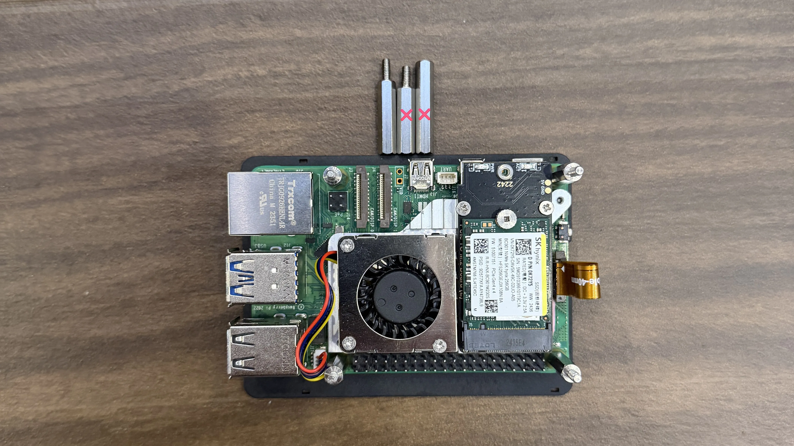
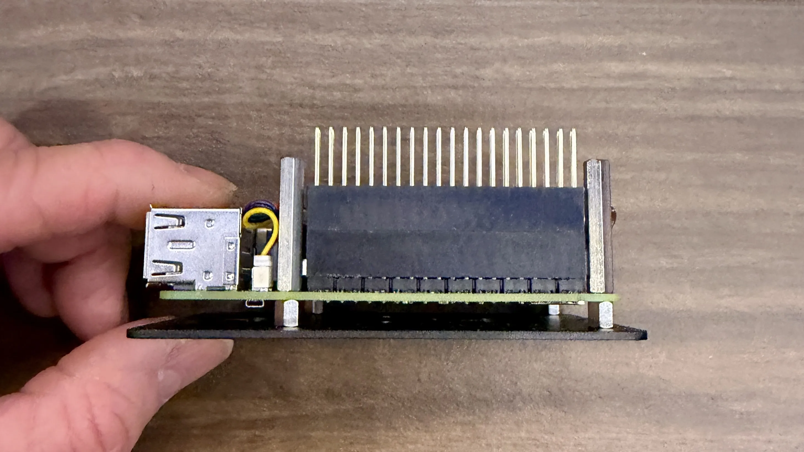
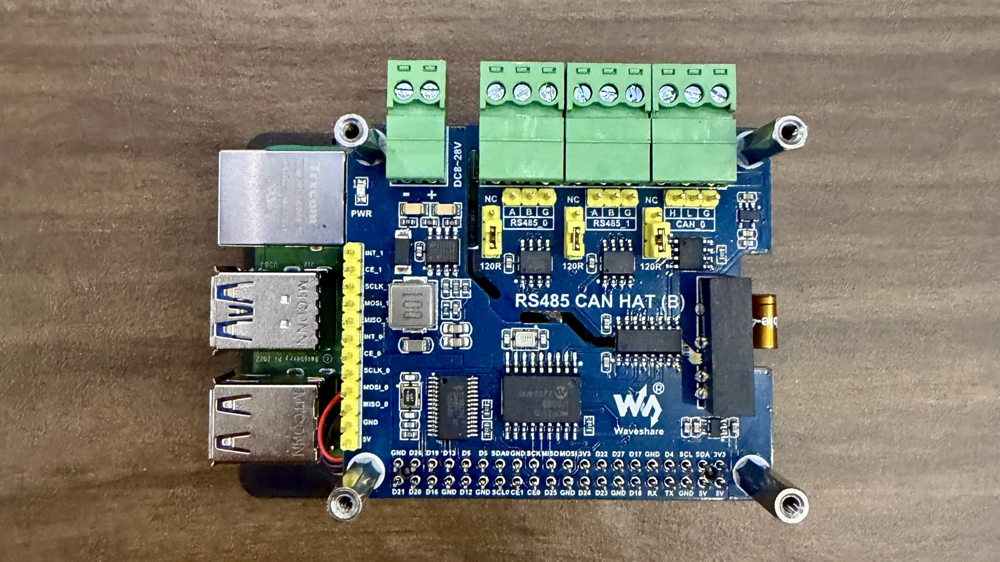
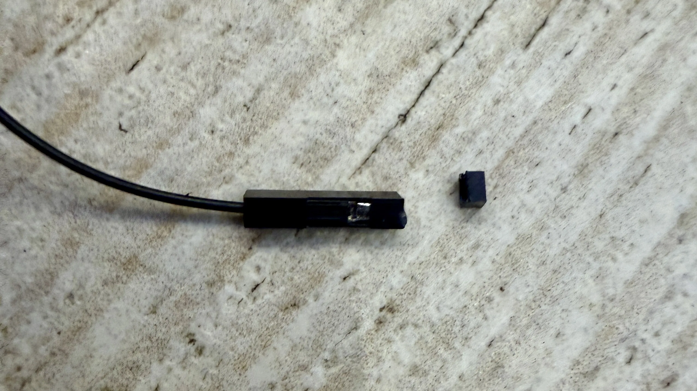
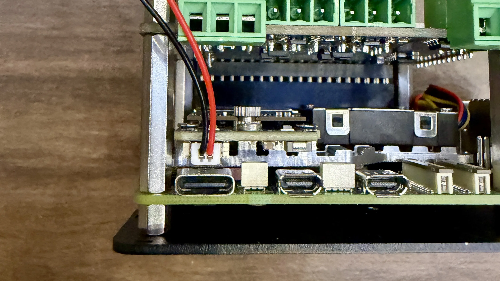
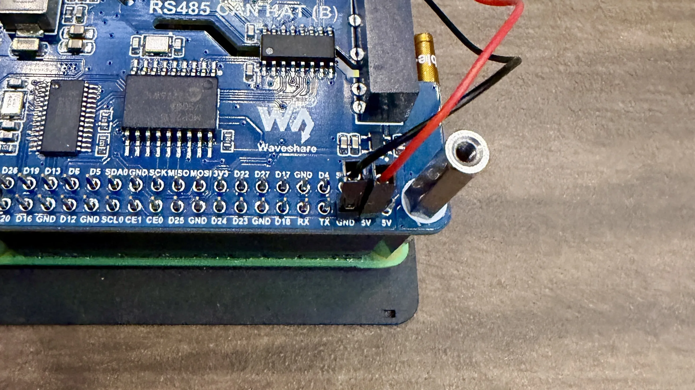
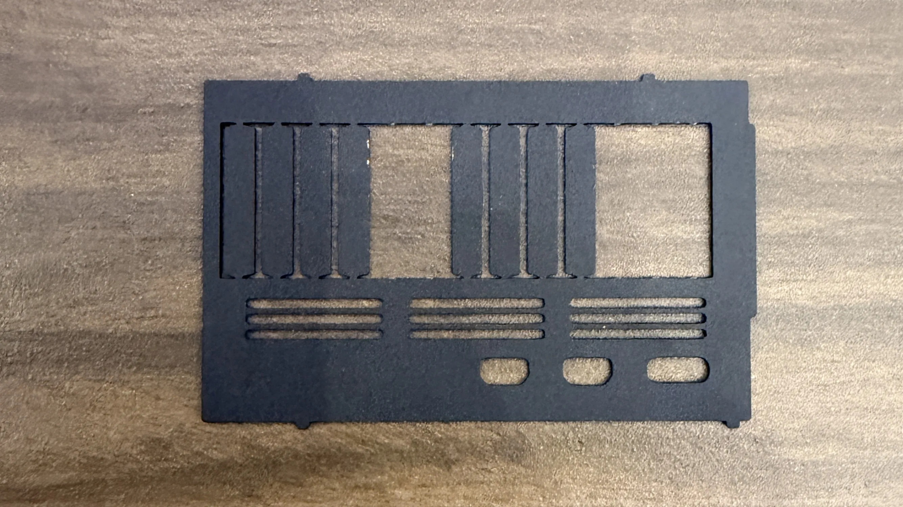
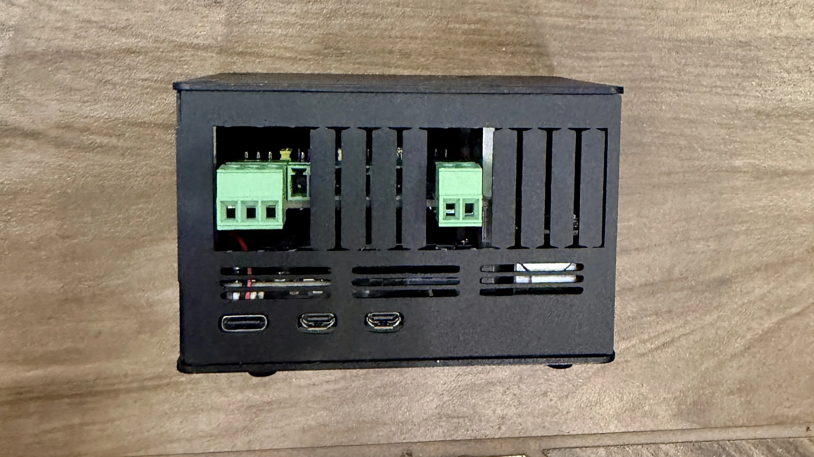

Follow this step-by-step guide to assemble your LibreCoach hardware. Take your time—proper assembly ensures reliable operation.

## Required Tools

- Phillips screwdriver (small)
- Flat head screwdriver (small)
- Wire strippers (thin gauge)
- Pliers
- Tweezers (helpful but not required)
- Clean, static-free workspace

## Step 1: Install Waveshare PCIe to M.2 Adapter (E)

### Apply Thermal Pads

1. Remove the thermal pads from the Waveshare PCIe to M.2 Adapter (E) packaging
2. Remove the thin plastic backing from the thermal transfer pads and apply them to the CPU (central, largest chip), the PMIC (power management chip, bottom left), and the Wi-Fi module (right side). Use the thinner pads for the CPU and Wi-Fi, and the thicker pad for the PMIC.
   

### Mount PCIe adapter

3. Be sure to remove the thin plastic backing from the top of thermal pads first
4. Place the PCIe adapter on the thermal pads
   
5. Align the PCIe adapter mounting holes on the bottom of the Raspberry Pi and secure with the included screws
   

### Connect the PCIe Ribbon

6. Locate the PCIe connector on the Raspberry Pi
7. Gently lift the black clip to open the connector
   
8. Insert the ribbon cable from the Waveshare adapter
   
9. Press down the black clip to secure the ribbon
   
10. The other end should be connected to the Waveshare PCIe adapter

## Connect the Fan

10. The Raspberry Pi fan connector has a small plastic cover that must be removed. Gently remove the cover using tweezers etc.
    
11. Connect the fan cable to the fan connector on the Raspberry Pi
    

### Mount the NVME Drive

12. Insert your NVME drive into the M.2 slot on the Waveshare PCIe adapter at a 30-degree angle
13. Press down gently and secure with the included screw
    

## Secure the Pi to the case

_Note: We will not use the screws or hardware that came with the CAN HAT and instead use the hardware from the case kit._

14. Install the shortest standoffs to all 4 corners of the case using the shortest screws
    
15. Place the Pi on the short standoffs and secure it with the longer female-female standoffs
    

## Mount the CAN HAT

16. Carefully align the short stacking header that came with the case with the Pi 40 pin GPIO header. Press down gently but firmly until fully seated. Then install the tall stacking header that came with the CAN HAT on top of the short header.  
    
17. Carefully install the CAN HAT onto the stacking header and secure with the longer male-female standoffs
    
18. Configure the 120Ω Termination Jumpers

:::note[Important]
The CAN HAT has jumpers for 120Ω termination resistors. They arrive in the On position and we need them in the Off position. Pull the jumper off and move it to the Off position:

- **Left jumper**: Incorrect position (resistor installed)
- **Right jumper**: Correct position (off)
  
  :::

### Connect NVME Additional Power Supply

19. The Waveshare PCIe TO M.2 Board (E) came with a small loose two wire power cable. Using wire cutters, clip off just the tip of both wire connectors. The goal is to remove the plastic at the end without cutting the metal connector inside. Perform a test of step 21 to understand why.
    
20. Connect the small power wires via the single small connector to the NVME board as shown
    
21. Connect the ends of the wires you clipped in step 19 to the GPIO pins labeled GND (black) and 5V (red). There are multiple pins of each available, it does not matter which ones are used.
    

## Assemble the Case

22. Remove the break out sections of the case side as shown. A small flat head screwdriver can help with the first bend of each section, then rock it back and forth until it breaks loose.
    
23. Ensure the top standoffs are tight as the case top screws into them
24. Assemble the case sides and attach the top using the remaining longer screws that came with the case
    

### Your hardware is now assembled!
