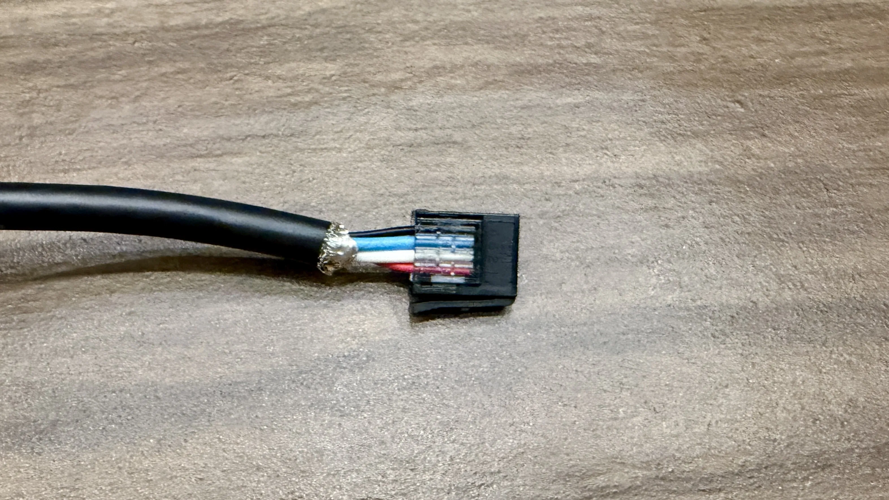
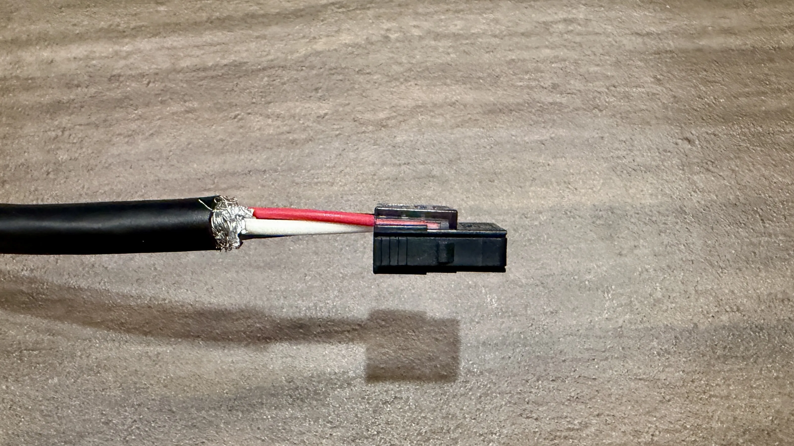
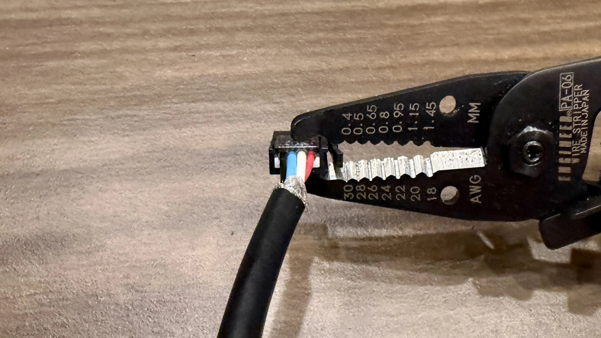
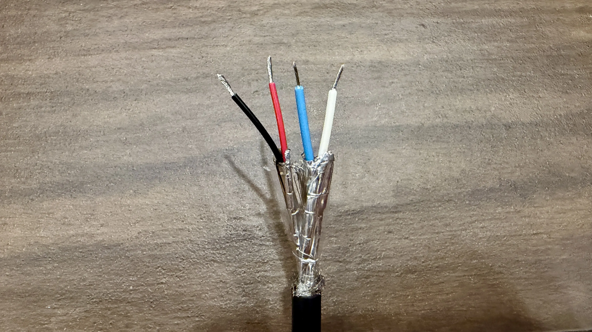
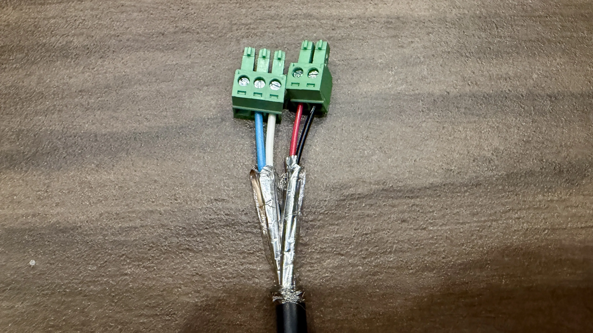
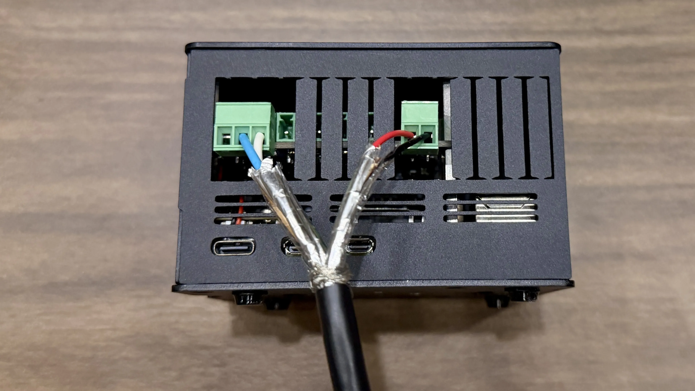

## Recommended CAN bus cable

- NMEA 2000 Backbone/Drop Cable <a href="https://amzn.to/4tbb3YZ" target="_blank" rel="noopener noreferrer nofollow sponsored">Amazon</a>
- _Specs_: 22AWG/2C and 24AWG/2C, shielded.

These instructions will guide you in creating a high-quality, shielded twisted-pair cable to connect your LibreCoach device to the RV's CAN bus. While other cabling methods are possible, we recommend this approach for its reliability, proper wire gauge, and ease of assembly. The recommended cable uses 22AWG wires, which are suitable for carrying the 12V power supply to the Pi. If you intend to power the Pi using a separate USB-C power supply, wire size is less critical, and alternatives like ethernet cable will work perfectly. You could also run two separate, dedicated wires for power if preferred.

## Prepare the Cable

1.  Cut the connectors off both ends of the NMEA 2000 cable. We will only be using the raw cable.

## Prepare End A

This end will connect to the RV using the 3M Mini-Clamp connector.

2.  Strip back the black outer jacket about **1 inch**. **Do not** strip the insulation from the individual small wires on this end. The 3M connector is designed to cut through the insulation.
    

3.  Insert the unstripped wires into the 3M Mini-Clamp connector exactly as shown. From the side with the retaining clip the color order is red, white, blue, black. Ensure they are fully seated.
    
4.  There will be a raised side to the connector.
    
5.  Squeeze the connector closed using pliers to lock the wires in place and make the electrical connection.
    

## Prepare End B

This end will connect to the screw terminals on the Waveshare CAN HAT.

6.  Strip back the black outer jacket about **2.5 inches**. Then strip approximately **1/4 inch** of insulation off the ends of the colored wires.
    
7.  Insert the stripped wires into the CAN HAT terminal connectors exactly as shown and tighten the screw.
    
8.  The terminal connectors will plug into the CAN HAT later when installed in the RV. (not necessary now)
    

### Your CAN cable is now ready!
