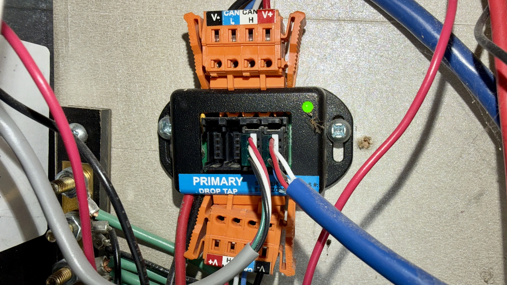
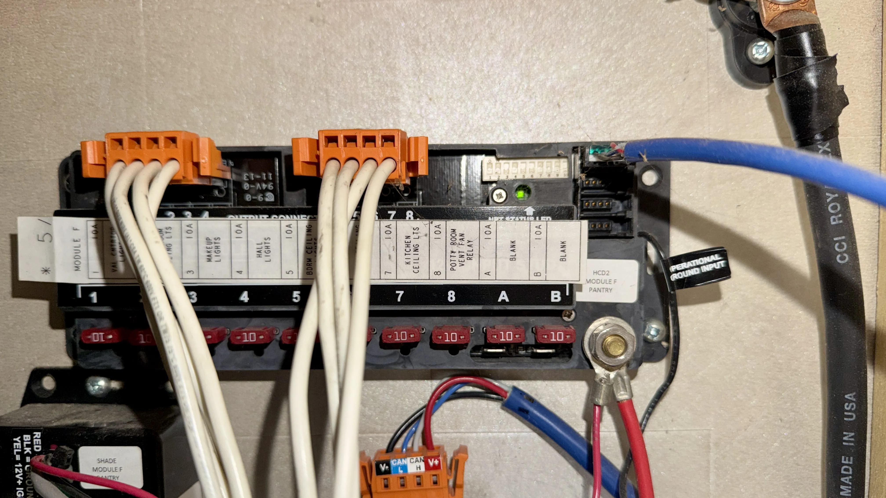
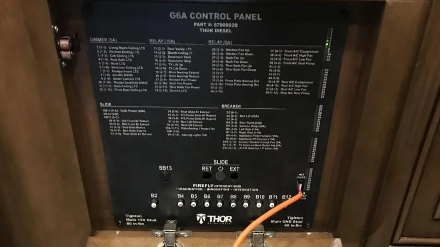

:::caution[Safety First]
Working with your RV's electrical system carries risks. While the RV-C network is low voltage (12V), accidental shorts can damage sensitive electronics or blow fuses. If you are uncomfortable working with wiring, consult a qualified RV technician.
:::

## Locating Your RV-C Network

The first step is finding where to plug in the hardware. Your RV-C network runs throughout your coach, but you need to find an accessible "tap" or open port. This is a socket that the 3M Mini Plug fits. A common place to connect is to the main control panel "net" port. However, you can connect to any available drop plug in the network and these can be just about anywhere. Some RVs have many empty ports throughout the coach, others only have one or two.

### Common Panel Locations by Manufacturer

- **Tiffin**: Often found behind the panel above the driver's seat or in the main electrical bay in the basement. Look for the "Spyder" controls.
- **Newmar**: Typically located in the main electrical cabinet (often in the bathroom or bedroom) or near the cord reel bay.
- **Entegra**: Frequently found behind the panel above the entry door or in the basement near the precision circuit board.
- **Other Brands**: Common spots include behind the main control panel keypad or in the electrical bay.

### What you're looking for

## Connection

Plug the 3M connector into the port and connect the screw terminals to the Pi. Once connected, the Pi should start up automatically. Return to Home Assistant.

_Once satisfield with the location, secure the Pi and wires for travel._
