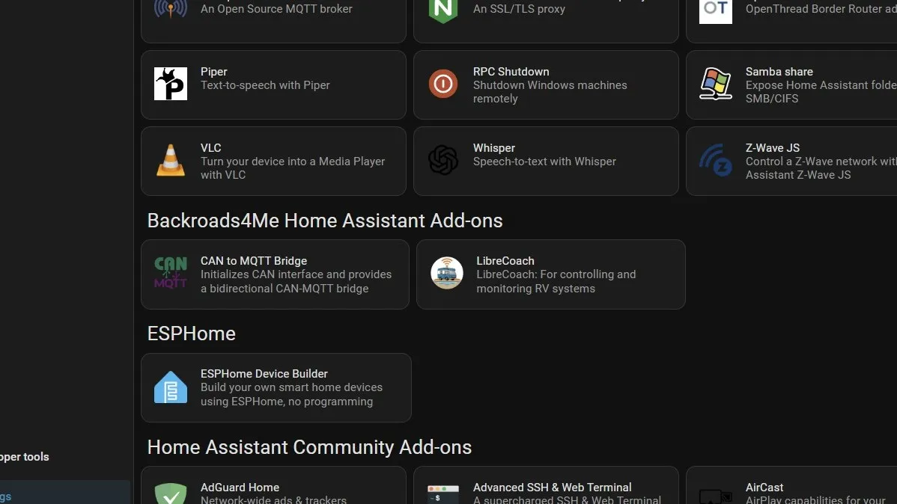
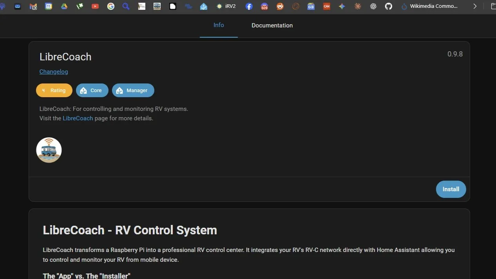
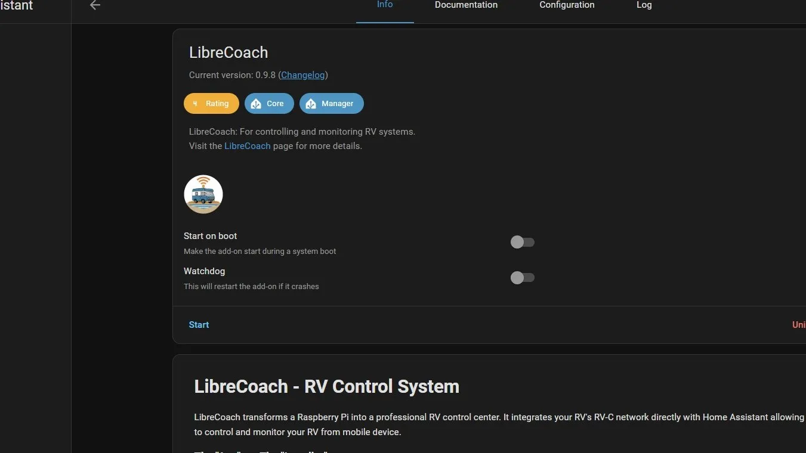
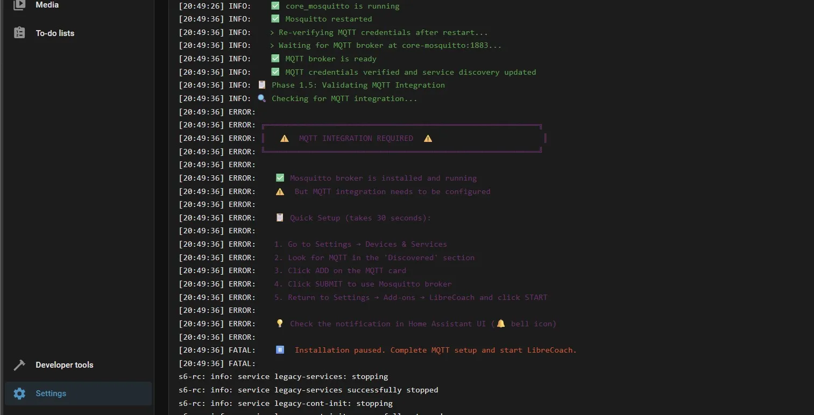
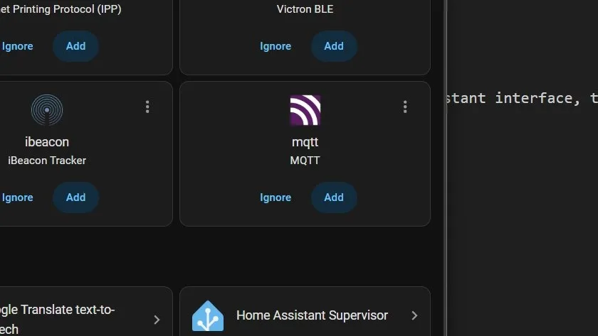
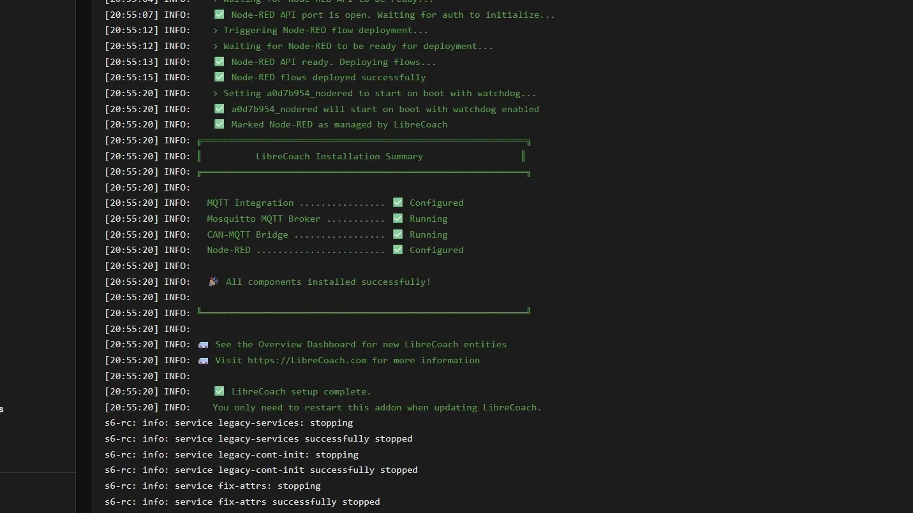

## First Boot

:::note[Ethernet Required]
The initial startup requires a **wired ethernet** connection for initial access to Home Assistant. You'll configure WiFi through the Home Assistant interface, then you can disconnect ethernet. The hardware does not yet need to be connected to your RV.
:::

1. Connect the Pi to your router via ethernet cable
2. Connect a USB-C power supply to the Pi
3. The Pi will likely startup when plugged in, if not, power on the Raspberry Pi using the button on the case.
4. Wait ~5 minutes for the initial boot and setup to complete

## Access Home Assistant

5. Open a web browser on a device connected to the same network
6. Navigate to: <a href="http://homeassistant.local:8123" target="_blank" rel="noopener">http://homeassistant.local:8123</a>
   - If that doesn't work, find the Pi's IP address in your router's admin page and use `http://<IP_ADDRESS>:8123`
7. Follow the Home Assistant onboarding wizard

## Configure WiFi (optional)

_Note: Where possible, a hardwired ethernet connection is more reliable._

If you want to use WiFi instead of ethernet:

8. Go to **Settings** → **System** → **Network**
9. Click **wlan0** under **Configure network interfaces**
10. Select your WiFi network then scroll down and select one of the security options (likely **WPA-PSK**) and enter the password

## Install LibreCoach Add-on

The LibreCoach add-on automatically installs and configures the following required apps:

- LibreCoach
- CAN-to-MQTT Bridge
- Node-RED with
- Mosquitto MQTT broker

### Add the Repository

Click the button below to add the LibreCoach add-on repository:

Or manually:

- Go to **Settings** → **Add-ons** → **Add-on Store**
- Click the three dots (⋮) in the top right → **Repositories**
- Add: `https://github.com/Backroads4Me/ha-addons`
- Click **Add** → **Close**

### Install the Add-on

11. In the Add-on Store (Settings → Add-ons), find **LibreCoach** in the repository list
    
12. Open it and click **Install**
    
13. After installation, go to the **Info** tab and click **Start**
    
14. After starting, go to the **Log** tab to monitor installation progress
15. LibreCoach wil automatically install several components, then pause, requiring user intervention.
    
16. Follow the instructions in the log and go to **Settings** → **Devices & Services**, then find **MQTT** and click **Add**
    
17. Return to **Settings** → **Add-ons** → **LibreCoach** and click **Start**, then monitor the remaining installation progress in the log
    

## Verify Installation

17. In Home Assistant, go to **Settings** → **Add-ons**
18. You should see:
    - **Mosquitto broker** (running)
    - **CAN-to-MQTT Bridge** (running)
    - **Node-RED** (running)
    - **LibreCoach** (stopped/grayed out after initial setup - this is normal)

### LibreCoach is now installed!

### Shutdown the Pi and connect to RV

19. **Settings** → **System**, **Power Button** (top right), **Advanced options**, **Shutdown system**
    
