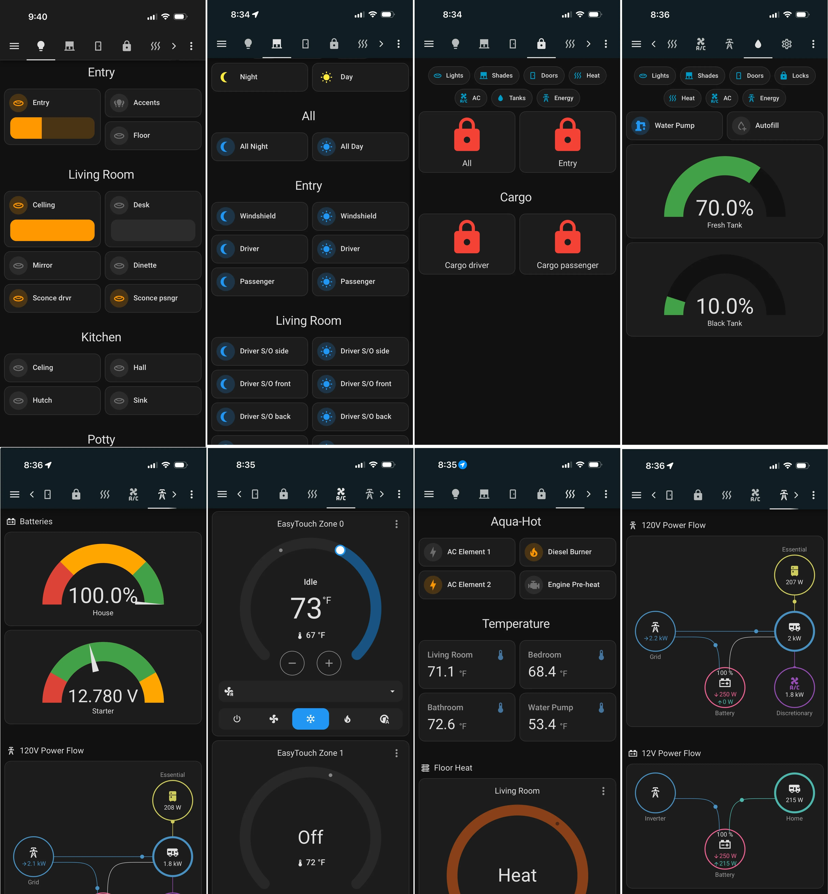

Once you've [identified your devices](/configuration/identify-devices/), it's time to create beautiful dashboards tailored to your RV's layout.

### Customized LibreCoach Dashboard

_Note: The dashboard below uses additional integrations and cards. See [Advanced Setup](/advanced-setup/) to learn more._

## Creating Your First Dashboard

### Step 1: Plan Your Layout

Before diving into Home Assistant, sketch out what you want:

- **By Function**: Lights, Climate, Water, Power
- **By Location**: Bedroom, Living Area, Galley, Exterior
- **By Use Case**: Daily Controls, Monitoring, System Status

Most RV owners find a hybrid approach works best: primary tabs by function, with location-based sections within each tab.

### Step 2: Create a New Dashboard

1. Go to **Settings** → **Dashboards**
2. Click **+ Add Dashboard** in the bottom right
3. Select **New dashboard from scratch**
4. Give it a name (e.g., "My RV") and click **Create**

### Step 3: Add Views (Tabs)

Create tabs for different areas:

1. Click the **✏️ Edit** button
2. Click the **+ Add View** button
3. Create views for each area:
   - Lighting
   - Climate
   - Water & Tanks
   - Power & Batteries

### Step 4: Add Cards

For each view, add cards to display and control your devices.

## Using YAML vs. Visual Editor

Home Assistant supports two methods for creating dashboards:

### Visual Editor (Recommended for Beginners)

- Click-and-drag interface
- Easy to get started
- Some limitations on advanced customization

### YAML Mode (Recommended for Sharing)

- Full control over layout and styling
- Easy to copy/paste and share
- Requires learning YAML syntax

**Pro Tip**: Start with the visual editor, then switch to YAML when you want to fine-tune or share.

## LibreCoach Example Dashboard

The LibreCoach Dashboard is a ready-to-use example built specifically for RVs. It's a good starting point — use it as-is, or pull out the parts that fit your rig.

**<a href="https://github.com/Backroads4Me/librecoach-dashboard" target="_blank" rel="noopener noreferrer">View the LibreCoach Dashboard on GitHub →</a>**

The dashboard has 10 views covering lights, shades, doors, locks, climate, energy, and tanks. Each view includes a navigation bar at the bottom so you can jump between sections from any screen.

## Exporting Your Dashboard

To share your dashboard with the community:

1. Open your dashboard
2. Click **✏️ Edit**
3. Click the **⋮** menu in the top right
4. Select **Raw configuration editor**
5. Copy the entire YAML configuration
6. Save it to a file (e.g., `my-rv-dashboard.yaml`)

## Importing a Dashboard

To use a dashboard shared by the community:

1. Go to **Settings** → **Dashboards**
2. Click **+ Add Dashboard**
3. Select **New dashboard from scratch**
4. Give it a name and click **Create**
5. Open your new dashboard
6. Click the **✏️ Edit** button
7. Click the **⋮** menu → **Raw configuration editor**
8. Paste the YAML configuration
9. Click **Save**

_📌 When importing a dashboard, you'll need to update the entity IDs to match your system._

## Community Dashboard Sharing

### Finding Dashboards for Your RV

1. Check <a href="https://discord.gg/VZCAESHn2h" target="_blank" rel="noopener noreferrer">Discord</a> or the <a href="https://www.facebook.com/groups/librecoach/" target="_blank" rel="noopener noreferrer">Facebook Group</a>
2. Search for your RV manufacturer (e.g., Newmar, Tiffin, Entegra)
3. Look for posts about your model and year
4. Download YAML files shared by other users

### Sharing Your Dashboard

Help grow the community by sharing your dashboard:

1. Export your dashboard YAML
2. Take screenshots of each view
3. Post on <a href="https://discord.gg/VZCAESHn2h" target="_blank" rel="noopener noreferrer">Discord</a> or the <a href="https://www.facebook.com/groups/librecoach/" target="_blank" rel="noopener noreferrer">Facebook Group</a>
4. Include:
   - RV make, model, and year
   - Description of your layout
   - Screenshots
   - YAML file (as an attachment or code block)
   - Any custom cards or integrations required

## Tips for Great Dashboards

1. **Keep it simple**: Don't overwhelm yourself with too many cards
2. **Group logically**: Put related controls together
3. **Use icons**: Visual icons are faster to recognize than text
4. **Test on mobile**: Most RV owners use tablets or phones
5. **Iterate**: Your first dashboard won't be perfect—refine as you use it
