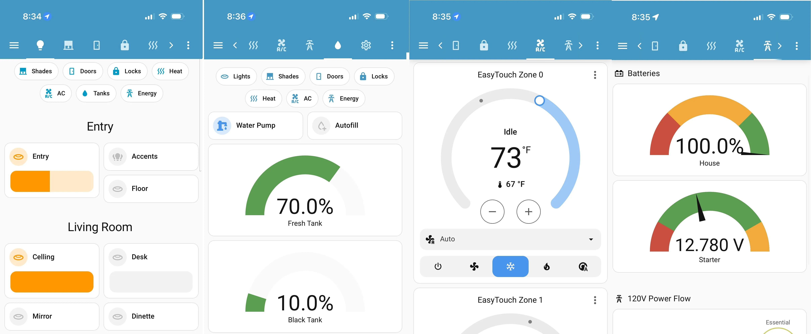
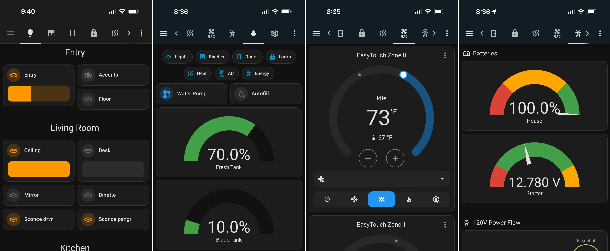

import { CardGrid } from "@astrojs/starlight/components";
import Card from "starlight-plugin-icons/components/Card.astro";
import { HeroX } from "@six-tech/starlight-theme-six/components";
import background from "../../../public/hero-light.svg";

<HeroX
  title="LibreCoach"
  tagline={`Take Your RV Further`}
  titleColor="#0b85aaff"
  taglineColor="var(--sl-color-text)"
  height="400px"
  radius="2rem"
  image={{
    background: background,
    alt: "Hero background image",
    backgroundSize: "cover",
    backgroundPosition: "right center",
    backgroundRepeat: "no-repeat",
    contentPosition: "middle-left",
  }}
  actions={[
    {
      text: "Learn How It Works",
      link: "/start-here/what-is-librecoach/",
      icon: "right-arrow",
      variant: "primary",
    },
  ]}
/>

## Everything You Need — Nothing You Don’t

<CardGrid>
  <Card title="Control Made Simple" icon="i-mdi:remote" bordered>
    Control lights, shades, locks, pumps, and other RV systems from a single, unified interface. Everything runs locally—no internet or cloud required.
  </Card>

<Card title="Auto-Discovery" icon="i-mdi:magnify-scan" bordered>
  LibreCoach automatically detects devices on your RV-C network — no manual
  configuration required.
</Card>

<Card title="Real-Time Monitoring" icon="i-mdi:pulse" bordered>
  Track tank levels, battery voltage, temperatures, and other sensors. Set
  alerts and catch issues early.
</Card>

  <Card title="Open Source & Extensible" icon="i-mdi:open-source-initiative" bordered>
    Built on Home Assistant and fully open source. Customize dashboards, automations, and integrations to fit how you actually use your RV.
  </Card>
</CardGrid>

## Choose Your Path

<CardGrid>
  <Card title="DIY Build" icon="i-mdi:hammer-wrench" bordered>
    Build your own LibreCoach system using recommended hardware and step-by-step guides. Ideal for tinkerers, makers, and tech-minded RV owners.

    [Start the Build Guide →](/build/hardware/)

  </Card>

  <Card title="Pre-Assembled Kit (Interest Check)" icon="i-mdi:package-variant-closed-check" bordered>
  Not a DIYer? I’m exploring the idea of a “plug and play” LibreCoach kit. Sign up if you’re interested — this is just an interest check, not a sale or obligation.

    [Join the Interest List →](/start-here/kit-interest/)

  </Card>
</CardGrid>
