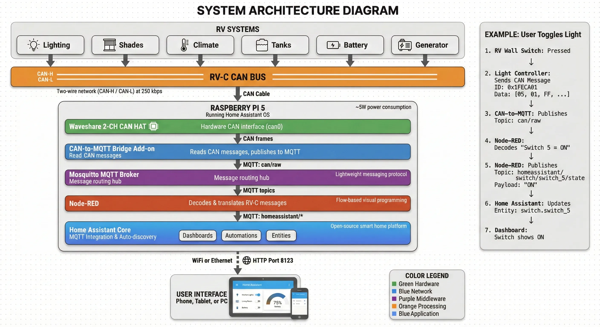

LibreCoach translates between your RV's systems and Home Assistant using two communication paths: the **RV-C CAN bus** for most RV systems, and **Bluetooth Low Energy** for devices like the MicroAir EasyTouch thermostat.

## Hardware

LibreCoach runs on commodity hardware that's easy to source and replace.

- **Raspberry Pi 5** — Host computer with NVMe storage support.
- **CAN HAT** — Adds a CAN controller to the Pi so it can talk to the RV-C network.

## Software Stack

The software runs as a set of Home Assistant Apps, managed by the Home Assistant Supervisor.

### 1. Home Assistant OS

The full OS version provides a Supervisor that manages updates, networking, and apps — keeping the system appliance-like and resilient.

### 2. MQTT Broker

The messaging layer that decouples all components. The Vehicle Bridge and Node-RED don't talk to each other directly — they share messages through MQTT.

### 3. Vehicle Bridge

A background service inside the LibreCoach app that handles all hardware communication:

- **CAN Bus** — Reads raw RV-C frames from the wire, publishes them to MQTT, and writes commands back to the bus.
- **Bluetooth** — Discovers and maintains persistent connections to supported BLE devices, publishing state and receiving commands through the same MQTT topics.

### 4. Node-RED

The logic layer. Decodes raw RV-C data into meaningful values, auto-discovers new devices on the bus, encodes commands, and handles integrations like Victron energy monitoring.

### 5. Home Assistant Core

Maintains device state, records history, and serves the dashboard to your browser or mobile device.

## Data Flow

### Turning on a Light (CAN Path)

1. You tap "Bedroom Light" in Home Assistant.
2. Node-RED encodes the RV-C command and publishes it to MQTT.
3. The Vehicle Bridge relays it through the CAN HAT onto the RV-C bus.
4. The lighting module executes the command and broadcasts a status update back through the same path.
