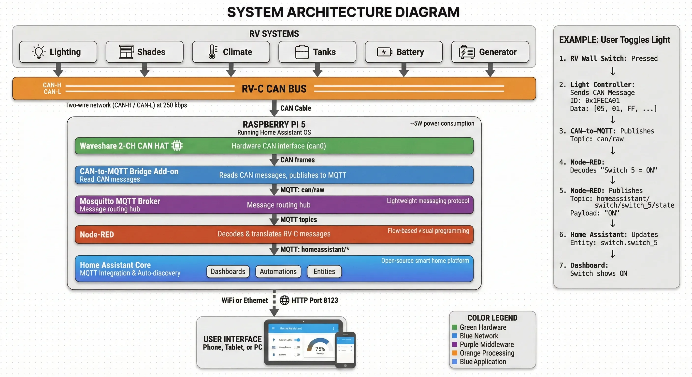
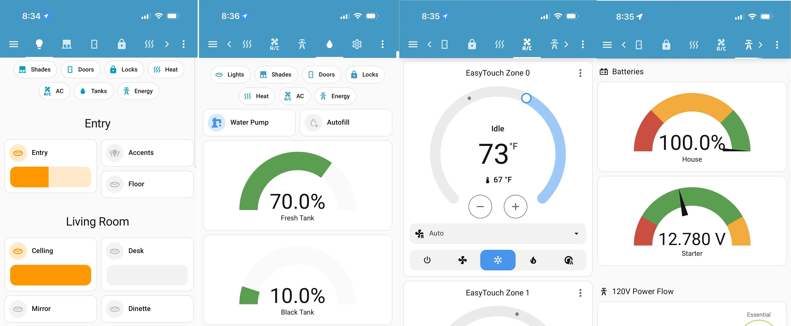
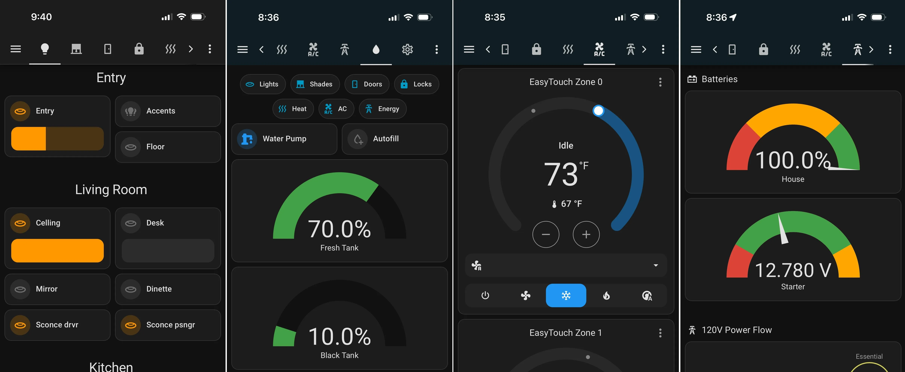

LibreCoach connects your RV's **RV-C based CAN network** to **Home Assistant**, so lights, climate, tanks, slides, and power systems can be monitored and controlled from hardware you own.

_📌 Older or fully analog RVs may not be compatible. LibreCoach does **not** replace your factory systems or safety-critical controls; it works alongside them for monitoring and convenience control._

## Why It Exists

If you own a modern RV, you've probably met the so-called "smart coach." You may also have discovered how quickly it stops being smart.

Manufacturers move on to new models and stop updating the software. When a control panel fails, the replacement can be an $1,800 dealer quote, sometimes for a simpler panel because the original part no longer exists. Lights, tanks, the inverter, and climate often live on separate panels that don't talk to each other. And the coach has no idea about the weather, your location, or your routines. It only reacts when you press a button.

The wiring and devices underneath are usually fine. What's missing is software you can keep running and improve.

## What LibreCoach Does

LibreCoach listens to your RV's existing control network and brings what it finds into Home Assistant.

It discovers lights, switches, tanks, and controllers on its own as they show up on the network, so there are no templates to write. It's designed for RVs with RV-C networks, including many motorhomes with Firefly, Spyder, and similar multiplexed control systems.

You can then control the coach from a phone, tablet, wall-mounted screen, or any web browser. The factory switches and panels keep working exactly as before. LibreCoach adds to them; it doesn't replace them.

The parts are standard and easy to replace. A complete DIY system typically costs **under $350**.

## Why Home Assistant

LibreCoach is built on **Home Assistant**, a widely used open-source home automation platform. That choice matters for a few reasons:

- It has over 2,500 integrations, including weather services, Starlink, Alexa and Google voice assistants, energy monitoring, and GPS-based automations.
- It has millions of users and an active development community. Even if LibreCoach development stopped tomorrow, Home Assistant would keep receiving updates and security patches.
- Your automations and settings live in Home Assistant, not in a vendor's touchscreen. You can upgrade hardware, move to a new system, and export your configuration.

## How It Works

1. A Raspberry Pi with a CAN HAT connects to your RV's CAN bus wiring.
2. The raw RV-C messages are passed along as MQTT messages.
3. Node-RED flows decode those messages and create entities in Home Assistant automatically.

For more detail, see [System Architecture](/reference/system-architecture/).

## What You Can Control

If a device speaks RV-C, LibreCoach can usually see it, and often control it:

- **Lighting**: Interior, exterior, and patio lights
- **Climate**: Thermostats, heat pumps, roof fans, floor heat
- **Plumbing**: Water pumps, fresh/grey/black tanks, LPG
- **Power**: Inverters, chargers, generators, supported solar controllers

## What Setup Looks Like

When LibreCoach first starts, it knows nothing about your coach. As it listens to the network, devices appear in Home Assistant with generic names like `switch_3`.

You walk through the coach, flip a switch, see which entity changes, and rename it to something like **Kitchen Light**. After that, it works like any other Home Assistant device. You don't need dealer tools or to reprogram anything in the coach. The [Identify Devices](/configuration/identify-devices/) guide walks through it.

## Getting Started

You can build the hardware yourself from standard parts. Plan on about $350 and a few hours of assembly and setup. If you'd rather not build it, you can join the interest list for a possible pre-assembled kit.

[View the Hardware & Assembly Guide](/build/hardware/)

[Pre-Assembled Kit Interest List](/start-here/kit-interest/)

## Need Help?

- Join the <a href="https://discord.gg/VZCAESHn2h" target="_blank" rel="noopener noreferrer">Discord</a> or <a href="https://www.facebook.com/groups/librecoach/" target="_blank" rel="noopener noreferrer">Facebook Group</a>
- Report issues or contribute on <a href="https://github.com/backroads4me/ha-addons/tree/main/librecoach" target="_blank" rel="noopener noreferrer">GitHub</a>
